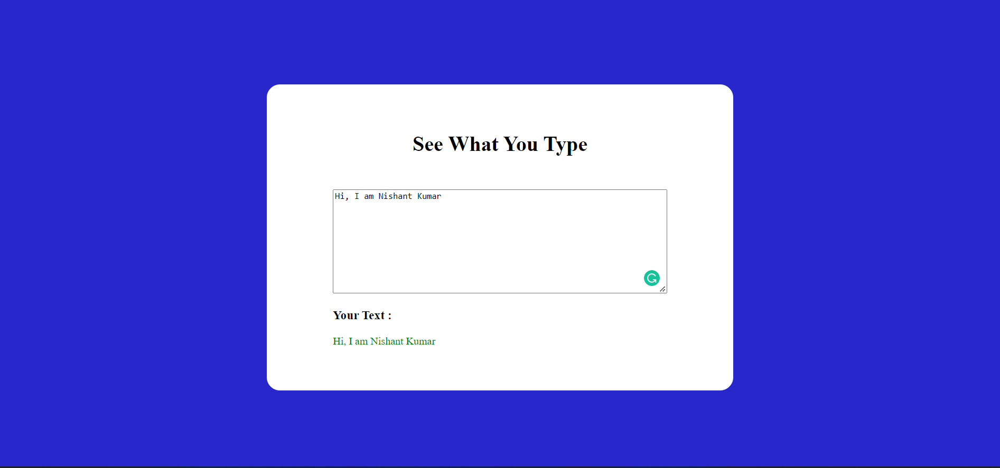

## What to build

we have to Design See What you Type App.

## Input

## Techanology used

we have used HTML, CSS and JavaScript DOM

## What I have learned from this project

I have learned how to get HTML element using DOM, And I read the data Enter by user and displaying that data back to page.

## Output

### Instructor

**Hitesh choudhary**
